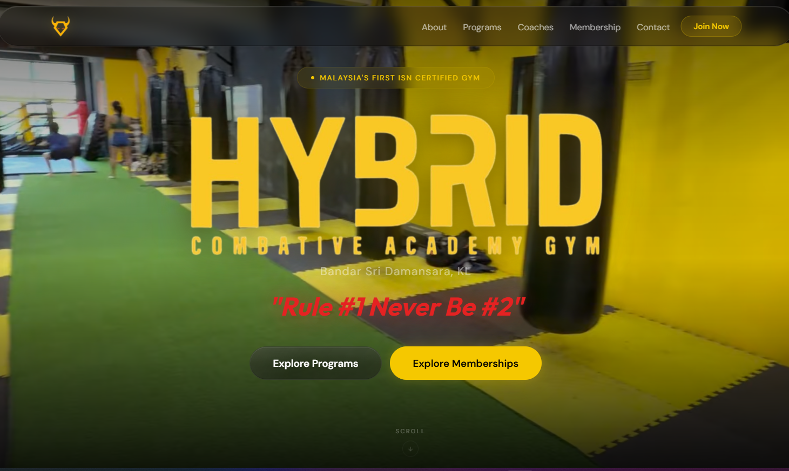

<div align="center">

# 🥊 HYBRID COMBATIVE ACADEMY & GYM

### *"Rule #1 Never Be #2"*

**Malaysia's First ISN Certified Gym — Bandar Sri Damansara, KL**

---


---



---

</div>

## ⚙️ Tech Stack


## 📊 Languages Breakdown

[](https://github.com/JohnsonLeoPatrick/hybridcombativegym)

## 📁 Project Structure

```
📦 hybridcombativegym
├── 📄 index.html              ← Main landing page
├── 📄 programs.html           ← Programs page
├── 📄 coaches.html            ← Coaches page
├── 📄 membership.html         ← Membership / pricing
├── 📄 contact.html            ← Contact page
├── 📂 css/
│   ├── base.css               ← Variables, reset, buttons
│   ├── nav.css                ← Navigation (dynamic island)
│   ├── hero.css               ← Hero section & ticker
│   ├── sections.css           ← About, ISN, Programs, Who, Why, Coaches
│   ├── membership.css         ← Pricing cards
│   ├── contact.css            ← Contact form
│   └── footer.css             ← Footer & responsive
├── 📂 js/
│   ├── script.js              ← Scroll, nav, animations
│   └── loader.js              ← Page loader
├── 📂 coaches/                ← Coach portrait photos
├── 📂 media/
│   ├── 📂 images/
│   │   ├── logo.png           ← Hybrid logo (transparent)
│   │   ├── isn-logo.png       ← ISN badge
│   │   ├── word logo.png      ← Hero wordmark logo
│   │   └── kickbox-bg.jpg     ← Membership card background
│   └── 📂 videos/
│       └── Background.mp4     ← Hero background video
└── 📂 notes/
    └── new changes.txt        ← Working changelog
```

## 🚀 Live Site

[](https://johnsonleopatrick.github.io/hybridcombativegym/)

## 🏋️ Features

- 🎬 **Full-screen hero** with background video
- 🏝️ **Dynamic island navigation** with scroll effects
- 📜 **Animated scroll reveals** throughout sections
- 🥋 **Coach profiles** with photos & credentials
- 💰 **Membership pricing cards** — no hidden fees, no lock-in
- 📱 **Fully responsive** — mobile, tablet, desktop
- 🏅 **ISN Certified** — Malaysia's first

---

<div align="center">

**Built with 💛 in Bandar Sri Damansara, KL**

*8 Years of Champions — Where Strength Meets Skill*

</div>

